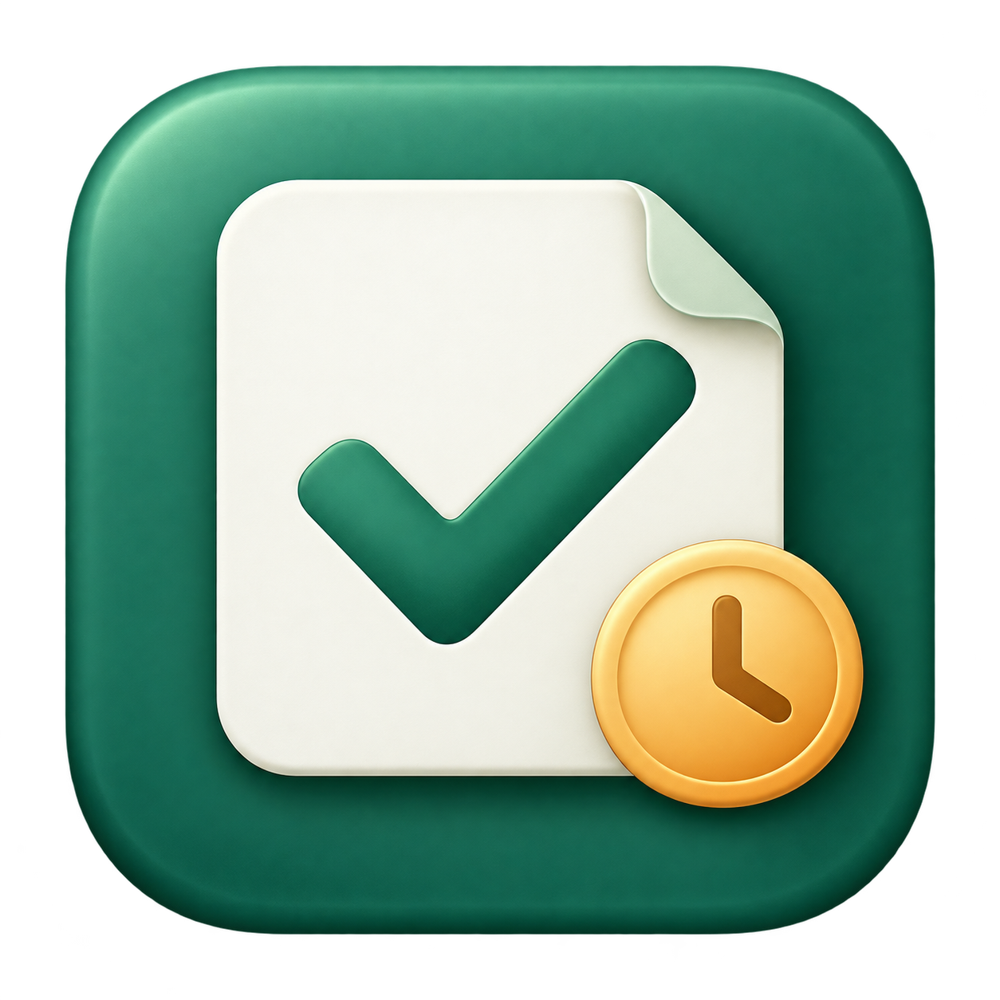
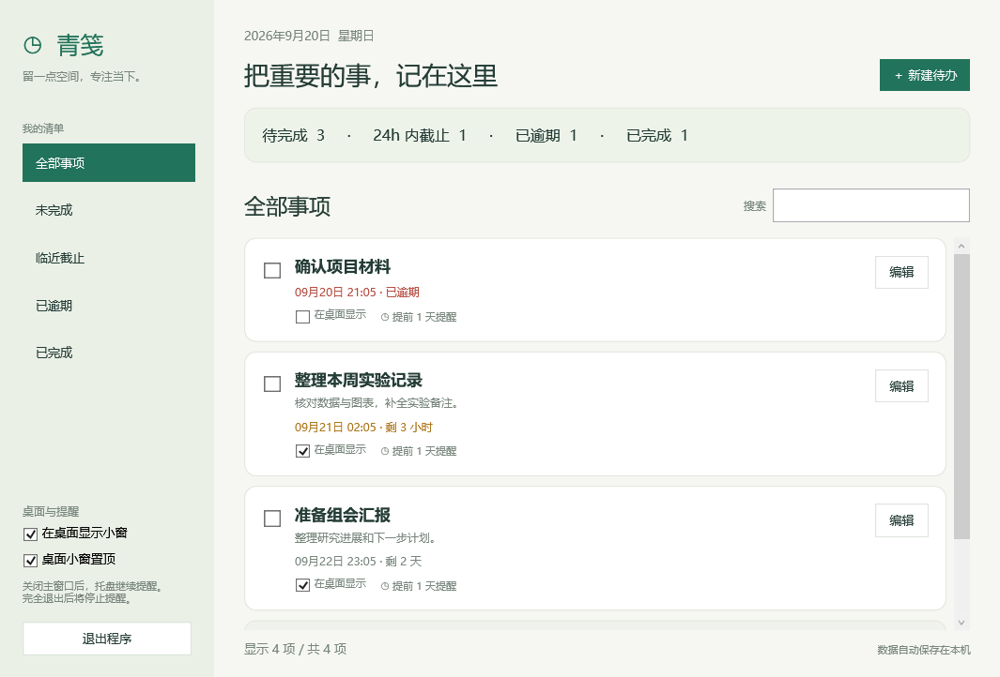
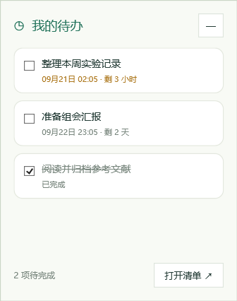
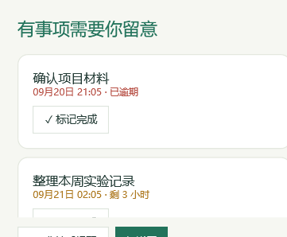
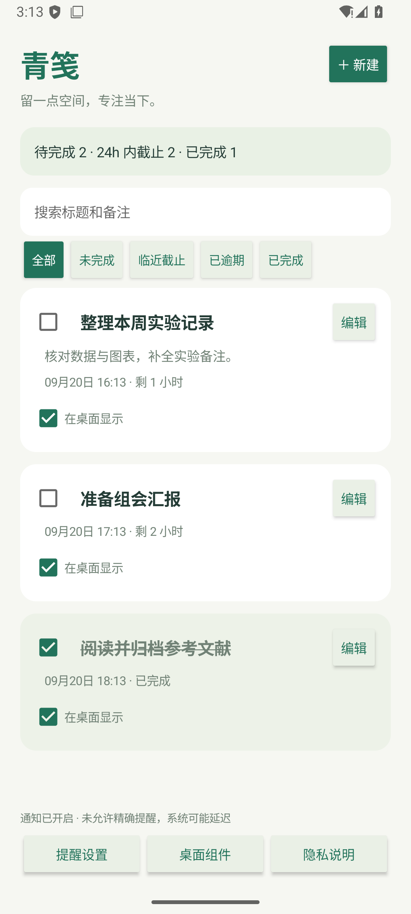
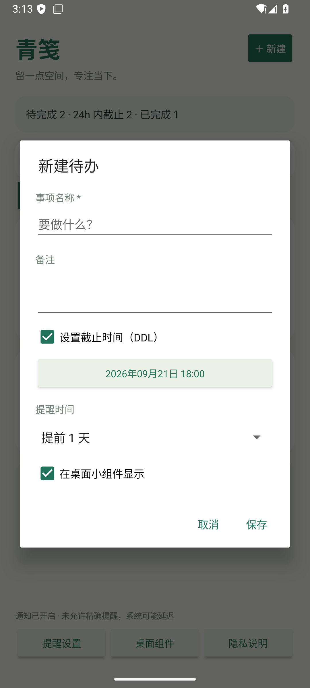

<p align="center">
  
</p>

<h1 align="center">青笺 QingJian</h1>

<p align="center">一张青笺，记下待办，也记得截止时间。</p>
<p align="center">Windows 与 Android 待办 · 桌面显示 · DDL 提醒 · 本地保存</p>

青笺是一款轻量的 Windows 待办应用。把事项、截止时间和完成状态放在一个清单里，也可以挑选几件重要的事，留在桌面上。



## 功能

- **待办管理**：新建、编辑和删除事项，支持备注、搜索与分类筛选。
- **完成划线**：勾选完成，再次点击即可恢复；主窗口与桌面小窗同步。
- **截止时间**：按 DDL 排序，区分 24 小时内截止与已逾期事项。
- **桌面小窗**：每条事项独立选择是否显示；小窗可拖动、调整大小和置顶。
- **截止提醒**：默认提前 1 天，也可选择提前 10 分钟至 7 天、仅截止时提醒或关闭提醒。
- **延后提醒**：弹窗中可以直接完成事项，或延后 10 分钟。
- **托盘运行**：关闭主窗口后继续提醒，从托盘随时打开。
- **本地保存**：数据自动保存，并保留上一个版本的备份。无需账号。

| 桌面小窗 | 截止提醒 |
| --- | --- |
|  |  |

以上截图均使用自检生成的演示事项，不包含真实个人数据。

## 开始使用

在 [Releases 下载 Windows 便携版](https://github.com/junhe-zhang/qingjian/releases/latest)，解压到可写入的文件夹，双击 `QingJian.exe`。

当前 Windows 构建适用于安装了 .NET Framework 4.8 的 Windows 10 / 11。便携版不需要安装步骤，也不需要网络连接。完整操作说明见 [使用说明](使用说明.md)。

### Android 预览版与商店准备

[预览版下载](https://github.com/junhe-zhang/qingjian/releases/tag/v1.1.0-preview)提供 Android 8.0 及以上使用的 APK，以及更新后的 Windows 便携版。

Android 支持待办、DDL、完成划线、搜索筛选、桌面小组件、通知和延后提醒。首次使用请在「提醒设置」允许通知；精确提醒需要系统授权。预览 APK 使用调试签名，应用名称为「青笺预览版」。Windows 与 Android 各自本地保存，目前没有跨设备同步。

<p> </p>

Windows 商店包和提交文案已准备，仍需开发者注册、应用标识关联与商店审核；尚未在 Microsoft Store 上架。Android 也尚未提交应用市场。

- [Microsoft Store 提交资料](store/Microsoft-Store-提交资料.md)
- [Android 构建与发布说明](store/Android-发布说明.md)
- [本次验证结果与待验证范围](store/验证记录.md)
- [隐私政策](https://junhe-zhang.github.io/qingjian/privacy.html) · [支持页面](https://junhe-zhang.github.io/qingjian/support.html)

> 提醒需要程序保持运行。关闭主窗口会留在系统托盘；完全退出、电脑关机或休眠时无法提醒。恢复运行后会检查尚未提醒的事项。

## 从源码构建

使用 Windows 自带的 .NET Framework C# 编译器与 WPF，无需 NuGet 依赖。

```powershell
powershell -NoProfile -ExecutionPolicy Bypass -File .\build.ps1
.\QingJian.exe
```

`build.ps1` 默认使用 `%WINDIR%\Microsoft.NET\Framework64\v4.0.30319\csc.exe`，并将 `app.ico` 嵌入程序。若需从原始 PNG 重新生成图标，可运行 `make-icon.ps1`。

## 自检

```powershell
$test = Start-Process .\QingJian.exe -ArgumentList '--self-test' -PassThru -Wait
$test.ExitCode
Get-Content .\verification\result.txt
```

成功时退出码为 `0`。检查覆盖提醒触发边界、重复抑制、完成与撤销、延后提醒、数据读写与备份、损坏数据处理、表单验证、新建与编辑、筛选与搜索，以及界面渲染。自检会短暂打开窗口，输出保存在 `verification/`，不会读取或修改个人清单。

## 数据存储

- 默认模式：`%LOCALAPPDATA%\QingJian\tasks.json`，备份为同目录的 `tasks.json.bak`。
- 便携模式：程序旁存在 `portable.flag`，或使用 `--portable` 参数时，保存到程序旁的 `data/`。发布的便携压缩包自带此标记。
- 旧版升级：默认模式首次运行时，会复制程序旁有效的旧 `data/tasks.json`，已有新位置数据时不会覆盖，原数据保留。独立安装的商店版不能自动找到其他文件夹中的便携数据。

备份前请退出程序，复制实际使用的数据目录；便携版更新时保留 `data/`。Android 数据位于应用私有 SQLite 数据库，卸载会删除。数据文件、构建产物和测试输出已通过 `.gitignore` 排除。

## 项目结构

```text
App.cs               WPF 界面、保存、提醒与自检
build.ps1            编译程序
make-icon.ps1        生成多尺寸 Windows 图标
app-icon.png         图标原图
app.ico              嵌入程序的图标
docs/                使用演示数据的界面截图
android/             Android 原生应用、桌面组件与测试
windows/             MSIX 清单与打包脚本
store/               商店提交资料和截图
使用说明.md           操作与备份说明
图标设计说明.md       AI 图标来源、提示词与转换方式
```

图标由内置图像生成工具创作，再转换为多尺寸 Windows ICO；详见 [图标设计说明](图标设计说明.md)。
